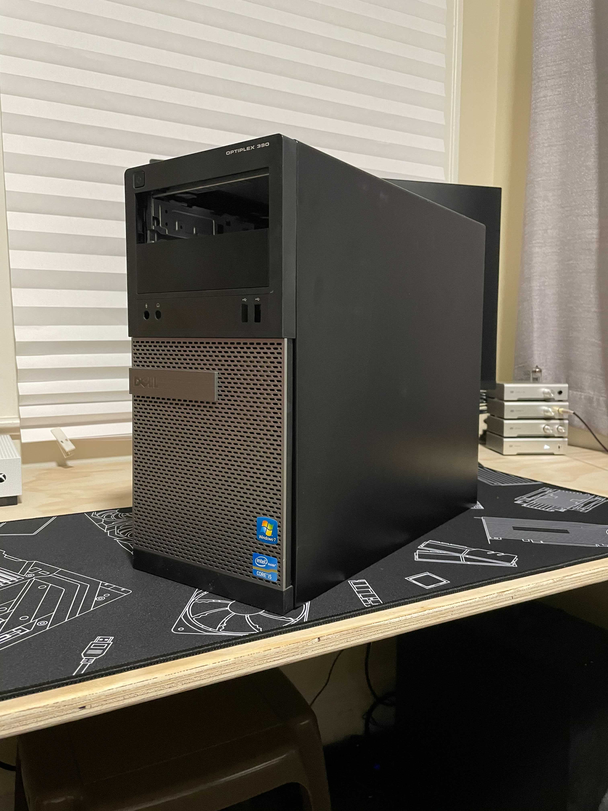
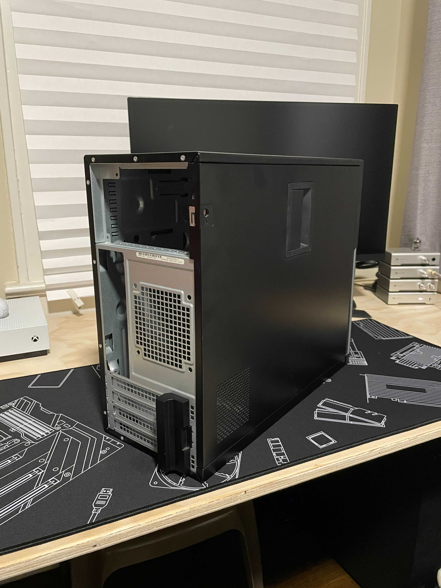
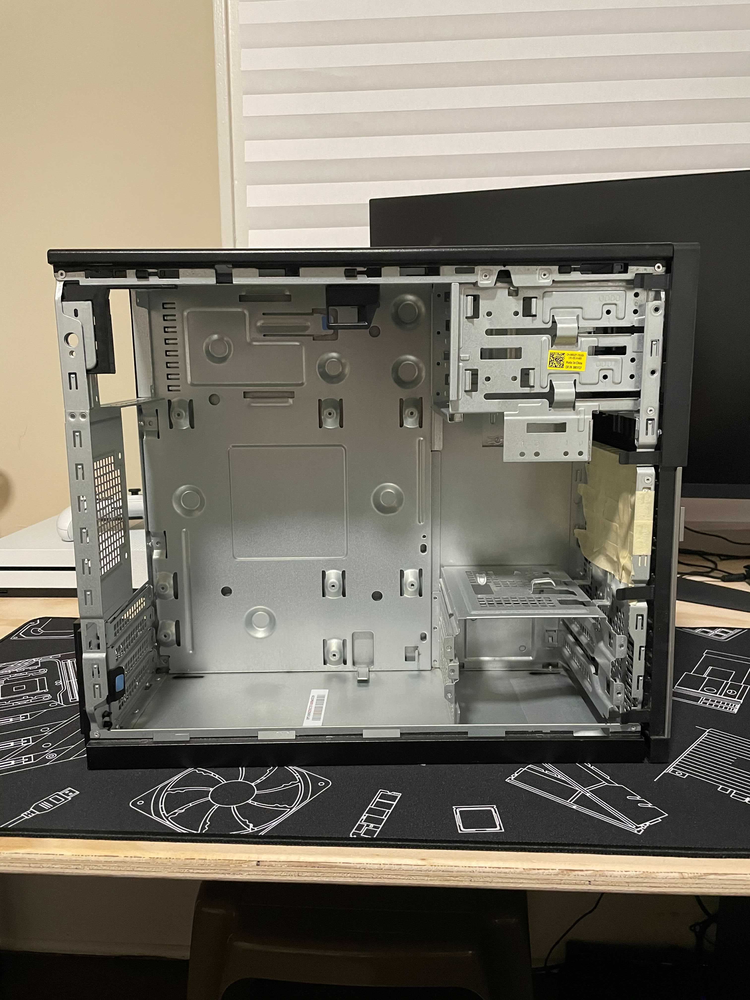
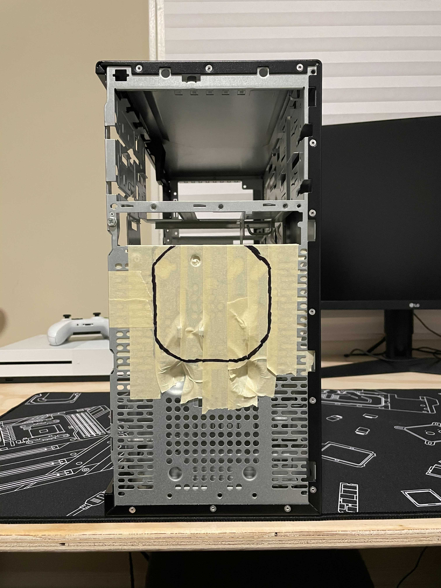
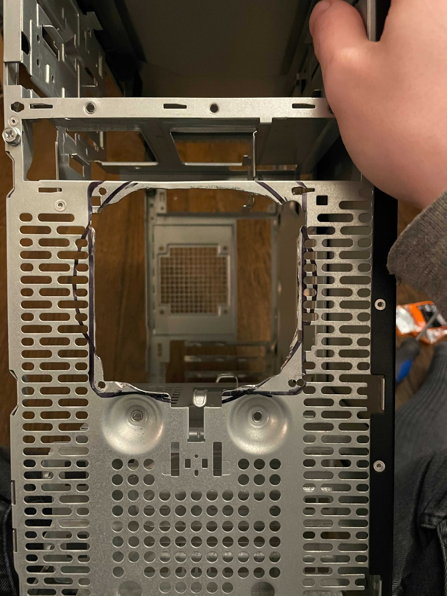
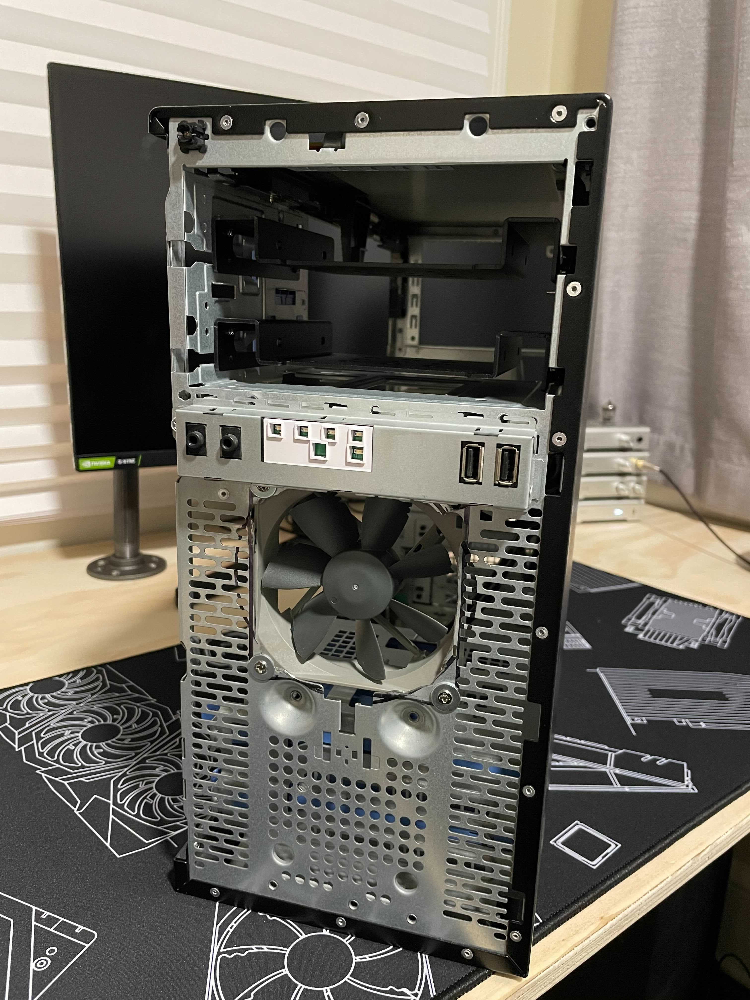
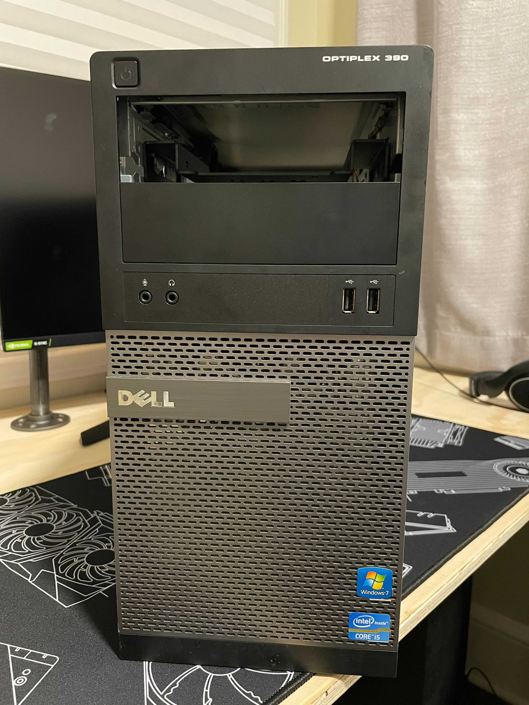
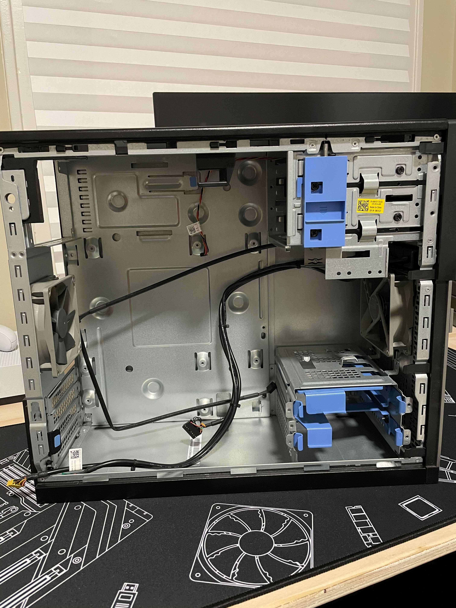

## After having some discussions with folks on the [/r/sleeperbattlestations](https://reddit.com/r/sleeperbattlestations) and [/r/sleepingoptiplex](https://reddit.com/r/sleepingoptiplex) subreddits, I wanted to toss up a quick post on what I'm doing with my server build.

The more I hear bad stories coming out of Silicon Valley regarding user privacy the more I want to de-Google-ify my life. Having calendars and email services and data stores available to me for free is super convenient but it's not worth the hassle of having to rely on a small handful of companies to do the right thing (regarding both security and ethics).

But I have been running some servers (mostly through Digital Ocean) for the last several years, so I am fairly comfortable running my own services.

And running a server in my apartment to have better stewardship of my data is right up my alley.

---

Honestly, I've been wanting to do this for a while. It'll be fairly easy for me to use something like Proxmox to stand up some services like NextCloud, Home Assistant, Gogs, a Minecraft server, and a handful of other things.

Just need to build the thing first, you know? I definitely want to build a sleeper. I always love seeing cool builds of great modern hardware in a retro-ish chassis, so picking out a case is obviously where I needed to start.

Whatever I chose needed to hold a motherboard with an AM4 socket and remind me of my childhood.

Something like the old beige tower from our guest room with a Pentium II in it or the charcoal Dell Dimension 4500-ish machine I used for my homework in middle school.

After a few failed Craigslist attempts to pick up a Dimension I ultimately settled on an OptiPlex 390.

Awww yeah, that's the stuff. Just like what my grade school computer labs used to run.

I managed to snag it for $20 from [ReSource in Williston, VT](https://resourcevt.org) while I was up north for a couple of weeks in December (after following all relevant VT state-mandated COVID-19 travel protocols).

Huge thank you to the fellow Champlain grad who helped me find and strip the computer from their warehouse!

Once I got home I worked on finalizing my parts list:

<a href="https://pcpartpicker.com/list/cgskmk">PCPartPicker Part List</a>
<table class="pcpp-part-list">
  <thead>
    <tr>
      <th>Type</th>
      <th>Item</th>
      <th>Price</th>
    </tr>
  </thead>
  <tbody>
    <tr>
      <td class="pcpp-part-list-type">CPU</td>
      <td class="pcpp-part-list-item"><a href="https://pcpartpicker.com/product/tLCD4D/amd-ryzen-9-3900x-36-ghz-12-core-processor-100-100000023box">AMD Ryzen 9 3900X 3.8 GHz 12-Core Processor</a></td>
      <td class="pcpp-part-list-price">
        Purchased For $380.00
      </td>
    </tr>
    <tr>
      <td class="pcpp-part-list-type">CPU Cooler</td>
      <td class="pcpp-part-list-item"><a href="https://pcpartpicker.com/product/gqxbt6/id-cooling-se-914-xt-basic-458-cfm-cpu-cooler-se-914-xt-basic">ID-COOLING SE-914-XT Basic 45.8 CFM CPU Cooler</a></td>
      <td class="pcpp-part-list-price">
        Purchased For $28.99
      </td>
    </tr>
    <tr>
      <td class="pcpp-part-list-type">Thermal Compound</td>
      <td class="pcpp-part-list-item"><a href="https://pcpartpicker.com/product/JmYLrH/arctic-mx-4-2019-edition-4-g-thermal-paste-actcp00002b">ARCTIC MX-4 2019 Edition 4 g Thermal Paste</a></td>
      <td class="pcpp-part-list-price">
        Purchased For $8.59
      </td>
    </tr>
    <tr>
      <td class="pcpp-part-list-type">Motherboard</td>
      <td class="pcpp-part-list-item"><a href="https://pcpartpicker.com/product/VyBhP6/gigabyte-b550m-ds3h-micro-atx-am4-motherboard-b550m-ds3h">Gigabyte B550M DS3H Micro ATX AM4 Motherboard</a></td>
      <td class="pcpp-part-list-price">
        Purchased For $101.02
      </td>
    </tr>
    <tr>
      <td class="pcpp-part-list-type">Memory</td>
      <td class="pcpp-part-list-item"><a href="https://pcpartpicker.com/product/gCCFf7/crucial-ballistix-32-gb-2-x-16-gb-ddr4-3200-memory-bl2k16g32c16u4b">Crucial Ballistix 32 GB (2 x 16 GB) DDR4-3200 CL16 Memory</a></td>
      <td class="pcpp-part-list-price">
        <a href="https://pcpartpicker.com/product/gCCFf7/crucial-ballistix-32-gb-2-x-16-gb-ddr4-3200-memory-bl2k16g32c16u4b">$148.99 @ Newegg</a>
      </td>
    </tr>
    <tr>
      <td class="pcpp-part-list-type">Storage</td>
      <td class="pcpp-part-list-item"><a href="https://pcpartpicker.com/product/P4ZFf7/samsung-970-evo-500gb-m2-2280-solid-state-drive-mz-v7e500bw">Samsung 970 Evo 500 GB M.2-2280 NVME Solid State Drive</a></td>
      <td class="pcpp-part-list-price">
        Purchased For $69.12
      </td>
    </tr>
    <tr>
      <td class="pcpp-part-list-type">Storage</td>
      <td class="pcpp-part-list-item"><a href="https://pcpartpicker.com/product/rkV48d/western-digital-internal-hard-drive-wd40efrx">Western Digital Red 4 TB 3.5" 5400RPM Internal Hard Drive</a></td>
      <td class="pcpp-part-list-price">
        <a href="https://pcpartpicker.com/product/rkV48d/western-digital-internal-hard-drive-wd40efrx">$104.99 @ Newegg</a>
      </td>
    </tr>
    <tr>
      <td class="pcpp-part-list-type">Storage</td>
      <td class="pcpp-part-list-item"><a href="https://pcpartpicker.com/product/rkV48d/western-digital-internal-hard-drive-wd40efrx">Western Digital Red 4 TB 3.5" 5400RPM Internal Hard Drive</a></td>
      <td class="pcpp-part-list-price">
        <a href="https://pcpartpicker.com/product/rkV48d/western-digital-internal-hard-drive-wd40efrx">$104.99 @ Newegg</a>
      </td>
    </tr>
    <tr>
      <td class="pcpp-part-list-type">Storage</td>
      <td class="pcpp-part-list-item"><a href="https://pcpartpicker.com/product/rkV48d/western-digital-internal-hard-drive-wd40efrx">Western Digital Red 4 TB 3.5" 5400RPM Internal Hard Drive</a></td>
      <td class="pcpp-part-list-price">
        <a href="https://pcpartpicker.com/product/rkV48d/western-digital-internal-hard-drive-wd40efrx">$104.99 @ Newegg</a>
      </td>
    </tr>
    <tr>
      <td class="pcpp-part-list-type">Storage</td>
      <td class="pcpp-part-list-item"><a href="https://pcpartpicker.com/product/rkV48d/western-digital-internal-hard-drive-wd40efrx">Western Digital Red 4 TB 3.5" 5400RPM Internal Hard Drive</a></td>
      <td class="pcpp-part-list-price">
        <a href="https://pcpartpicker.com/product/rkV48d/western-digital-internal-hard-drive-wd40efrx">$104.99 @ Newegg</a>
      </td>
    </tr>
    <tr>
      <td class="pcpp-part-list-type">Video Card</td>
      <td class="pcpp-part-list-item"><a href="https://pcpartpicker.com/product/x7s8TW/msi-geforce-gtx-1050-ti-4gb-video-card-gtx-1050-ti-4gt-oc">MSI GeForce GTX 1050 Ti 4 GB Video Card</a></td>
      <td class="pcpp-part-list-price">
        Purchased For $212.69
      </td>
    </tr>
    <tr>
      <td class="pcpp-part-list-type">Power Supply</td>
      <td class="pcpp-part-list-item"><a href="https://pcpartpicker.com/product/mPdxFT/seasonic-focus-sgx-650w-80-gold-certified-fully-modular-sfx-power-supply-ssr-650sgx">SeaSonic FOCUS SGX 650 W 80+ Gold Certified Fully Modular SFX Power Supply</a></td>
      <td class="pcpp-part-list-price">
        Purchased For $139.30
      </td>
    </tr>
    <tr>
      <td class="pcpp-part-list-type">Case Fan</td>
      <td class="pcpp-part-list-item"><a href="https://pcpartpicker.com/product/jZn2FT/noctua-case-fan-nfb9redux1600pwm">Noctua B9 redux-1600 PWM 37.85 CFM 92 mm Fan</a></td>
      <td class="pcpp-part-list-price">
        Purchased For $10.95
      </td>
    </tr>
    <tr>
      <td class="pcpp-part-list-type">Case Fan</td>
      <td class="pcpp-part-list-item"><a href="https://pcpartpicker.com/product/jZn2FT/noctua-case-fan-nfb9redux1600pwm">Noctua B9 redux-1600 PWM 37.85 CFM 92 mm Fan</a></td>
      <td class="pcpp-part-list-price">
        Purchased For $10.95
      </td>
    </tr>
    <tr>
      <td class="pcpp-part-list-type">Custom</td>
      <td class="pcpp-part-list-item"><a href="https://pcpartpicker.com/product/QVFXsY/orico-aluminum-525-inch-to-25-or-35-inch-internal-hard-disk-drive-mounting-kit-with-screws-and-shock-absorption-rubber-washer-black">ORICO Aluminum 5.25 inch to 2.5 or 3.5 Inch Internal Hard Disk Drive Mounting Kit with Screws and SHOCK Absorption Rubber Washer- Black</a></td>
      <td class="pcpp-part-list-price">
        Purchased For $8.79
      </td>
    </tr>
    <tr>
      <td class="pcpp-part-list-type">Custom</td>
      <td class="pcpp-part-list-item"><a href="https://pcpartpicker.com/product/QVFXsY/orico-aluminum-525-inch-to-25-or-35-inch-internal-hard-disk-drive-mounting-kit-with-screws-and-shock-absorption-rubber-washer-black">ORICO Aluminum 5.25 inch to 2.5 or 3.5 Inch Internal Hard Disk Drive Mounting Kit with Screws and SHOCK Absorption Rubber Washer- Black</a></td>
      <td class="pcpp-part-list-price">
        Purchased For $8.79
      </td>
    </tr>
    <tr>
      <td class="pcpp-part-list-type">Custom</td>
      <td class="pcpp-part-list-item">Dell Optiplex 390</td>
      <td class="pcpp-part-list-price">Purchased For $20.00</td>
    </tr>
    <tr>
      <td></td>
      <td class="pcpp-part-list-price-note">Prices include shipping, taxes, rebates, and discounts</td>
      <td></td>
    </tr>
    <tr>
      <td></td>
      <td class="pcpp-part-list-total">Total</td>
      <td class="pcpp-part-list-total-price">$1568.14</td>
    </tr>
    <tr>
      <td></td>
      <td class="pcpp-part-list-price-note">Generated by <a href="https://pcpartpicker.com">PCPartPicker</a> 2021-02-03 22:13 EST-0500</td>
      <td></td>
    </tr>
  </tbody>
</table>

I'm overbuilding the hell out of this thing, but it should last me a long, long time. Once my new power supply comes in (more on that later), I'll just need to order the RAM and hard drives before I can start building.

Once I got the parts figured out, I needed to tackle modding the case a bit to fix the obvious airflow problem.

The back looks fine. Plenty of slots for the 1050 Ti (potential hardware transcoding), a regular size cutout for rear IO, room for a full-sized PSU, and even a spot for a fan!

Inside is super clean once you strip it down. Screw layout for a standard Micro-ATX motherboard, two dedicated slots for drives, two 5.5" slots (surprise, more hard drives), and plenty of room in the front I can take advantage of for a fan intake.

The only issue here is that while there's plenty of room for a full-sized ATX power supply in here, I missed that black hook for the side panel latch even after measuring twice. The ATX unit I ordered didn't quite fit so I hard to return it for the SGX form factor one, which SHOULD fit. That'll be coming in the mail by the end of this week - fingers crossed.

The one real bit of modding I had to do was cutting a hole in the front of this thing. One fan wasn't going to cut it, so I wanted to throw an intake in there too.

I forgot to take a picture before I taped it up, but the whole front is the same type of metal grille that you can see right below the tape line.

Either way: I taped it up, marked out the hole so that there was still room for mounting hardware, and cut the thing out with a rotary tool.

Not the prettiest cut, but not bad for my first job with a new tool.

The fan mounted nice enough after I gave the mounting holes a second pass to make sure everything lines up. Plenty of room for airflow.

And honestly, once I got the front panel back on, you can't even tell the case has been modded.

After using some canned air to get all the dust and stuff out, I tossed the exhaust fan and all the odds & ends that came with the shell back in.

Like I said, there are still a few parts to order before I can start the build in earnest.

Might even take a day off work for all the fun. ;)

---

That adventure will be worthy of a whole other post.

Once that's up, it should be followed by another one on setting up Proxmox.

Can't wait to share more with y'all!

Stay frosty.

- [https://henryneeds.coffee](https://henryneeds.coffee) ([IPFS Version](https://whateverforever.party))
- [Blog](https://henryneeds.coffee/blog) ([IPFS Version](https://whateverforever.party/blog))
- [LinkedIn](https://linkedin.com/in/henryquinniv)
- [Twitter](https://twitter.com/quinncuatro)
