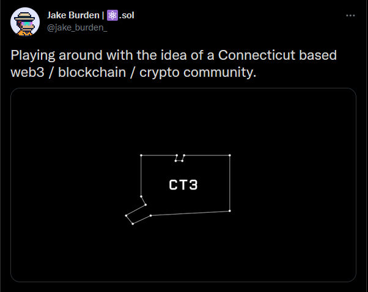
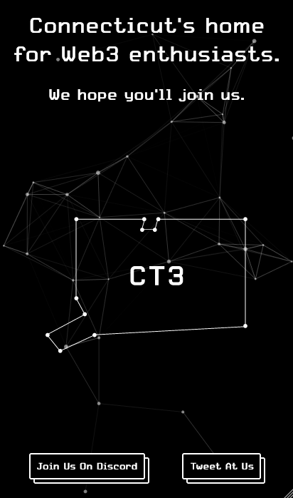

## Back in 2017, I (and I imagine a LOT of other people on DEV.to) got really into cryptocurrencies. I made some beer money off Ethereum, followed some projects, and really dug into the kind of experiences blockchain technology was able to power.

Everyone I talked to seemed understandably smitten with the concept of decentralized finance, but I was trying to cut through the noise of all the day trading in an attempt to find where actual bedrock innovation was being made.

I sifted through a lot of altcoins and vaporware to find projects like [Golem](https://www.golem.network/) (a way for folks to rent spare computing cycles to artists who need to render their work), [IOTA](https://www.iota.org/) (a network built to handle IoT transactions), and [Request Network](https://request.network/en/) (a suite of financial tools for crypto payments). These were teams that bucked the trend of trying to make a boatload of money and instead were actually trying to change the way that we interact with the Internet. Something about these teams of people in the middle of one of the craziest bull runs of history saying "screw the quick money, what we're working on is IMPORTANT" really stuck with me.

---

Then the bubble burst, the hype died down, and I yanked out most of my (meager) investments. I kept a loose eye on the space just to keep up to speed over the years but was hesitant to get involved again.

But somewhere around the beginning of this year, I started looking into decentralization technology that wasn't necessarily on a blockchain, as I didn't love the ecological impact of networks like Ethereum. That led to me spending time digging into [IPFS](https://ipfs.io/) and getting closer with [Jake](https://twitter.com/jake_burden_/) from my local tech Slack who's really into [Solana](https://solana.com/) - a blockchain that's fast, cheap, and not burning down the rainforests.

> ## Once I really understood what Solana could do, it felt like a switch got flipped in me.

That's about when I caught a tweet from [Nader Dabit](https://twitter.com/dabit3/) about [Developer DAO](https://www.developerdao.com/), saw that I had enough ETH left in an old wallet to cover the transaction fee, and just yolo'd it. I bought my first NFT and simultaneously joined my first decentralized autonomous organization (DAO).

The first few days of being part of a DAO filled with people just like me were wild. Everyone in the Discord was trying to learn everything they could from each other about web3 technologies, work on their own separate projects, and then dump all that knowledge and energy back into the group. The value wasn't in a cryptocurrency attached to the project, it was in the community itself. That was like a breath of fresh air.

I love helping run my local tech group but there's a certain freedom in how a DAO allows everyone to make decisions and collectively help shape the future of the thing. Every little proposed change doesn't have to route through a small team of admins. People can contribute development work, documentation, insights, or anything... whenever they have the time. And if something in the DAO needs to change everyone can discuss their viewpoints and vote on a proposal. It turns an online community into a sort of living organism rather than a top-down hierarchy where an organizing team gets to call the shots.

> ## Ultimately, my point is that helping the group comes back to helping yourself.

I distinctly remember sitting back and thinking of my crypto journey around 2017 when I was looking through projects trying to find innovative web experiences powered by blockchain technologies that just didn't make sense using web2 technologies at the time. In 2021, amidst all of the NFT sales going on, I really and truly feel that this new community-owned organization model is the killer app.

Jake pointed me towards some more projects on Solana (surprise!) that shared that same sense of community. I ended up finding groups that welcomed me with open arms and immediately made me feel like one of their own:

- [Nifty Nanas](https://www.niftynanas.com/): This one is arguably where I spend most of my time on Discord. It's a community of wonderfully positive people who want to help support other projects in the Solana ecosystem. They do a lot of giveaways, game nights, and Twitter Spaces (with other web3 projects) and it feels like a real group of friends. Plus the NFT art is rad - just _look_ at my profile picture.

- [WGMI NFT Collector's Club](https://wgmi.cc/): A rad group of people doing a series of community art projects where holders of their WGMI token get airdrops throughout the year of NFTs that are part of interactive experiences. On day one of me being involved, I got to hop on a call and help brainstorm ideas for a future airdrop.

- [Tech Folk](https://techfolk.io/): A team who's working on an NFT game based around working together to build startups, upskill "employees", and vying for investors. They've been nothing but helpful in answering peoples' questions, including my own, about web3 development.

- [Hoodiez NFT](https://www.hoodieznft.net/): Just a bunch of people hanging out and using NFTs to raise money for both homeless and mental health-focused charities. This is actually the first project where I got to be involved in the initial mint and it's been fun watching the community grow. 

About two weeks ago, I remembered [one of Jake's tweets](https://twitter.com/jake_burden_/status/1455549038527406084) from earlier in the month:

I've been wanting to find a way to get more involved in the crypto community and this seemed like the perfect opportunity. I have a few years of running a locally-focused tech community under my belt, and to be quite honest - the members there were getting fed up with the few of us talking about blockchain stuff. Jake had been joking for a while about "wen [local tech group] DAO," and I figured it was time to make it happen.

So after letting him know I wanted to make it real, we (and our friend [Rory](https://twitter.com/Rory_Chillmore)) jumped feet first into building it.

We fleshed out a Discord server, set up a [Twitter account](https://twitter.com/ct3_dao), and built a [rad website](https://ct3dao.io). We were in the process of talking behind the scenes about what direction we wanted to nudge this new community in before we started inviting people in when I discovered [buildspace](https://twitter.com/_buildspace).

Up to that point, I had been learning bits and pieces of existing projects I could pull together from the Solana ecosystem. But having buildspace provide a built-in community of developers working on similar project prompts allowed me to get my hands dirty with the real thing.

Bear in mind, we're still going to use tools like [Grape](https://grapes.network/) (for account/wallet verification on our Discord) and [Squads](https://sqds.io/) (to handle on-chain voting). But I was low-key dreading having to roll my sleeves up and get dirty with the code to learn how any of it worked under the hood.

> ## If you've ever tried building with a new technology, you know the documentation isn't the best if it's even there at all.

That's the vibe I've gotten from most of my forays into dApp development over the years: things are going to be messy and you're going to have to solve your own problems. Not a big deal. That's actually a great way to learn and make all those new concepts stick, but it's not the most attractive first experience with a tool.

The "Build a Web3 App on Solana with React and Rust" project really helped me understand how the websites I've been using actually interacted with both my wallet and the Solana blockchain. I was able to get a [dApp for collecting rock climbing gifs](https://vercel.com/quinncuatro/gif-portal-starter/EmMEpi2xpLL5YDyTXnuif1GXR6yu) that uses Phantom for authentication deployed to Solana's devnet within 24 hours of starting the project.

I know the community management piece required to get a group like ct3_dao off the ground, but I'm helping build a community to help people learn web3 development partly because I want to learn how to code for web3 projects. And buildspace really comes in clutch there.

## BUT Y'ALL. THEN THEY DID IT AGAIN.

Right when we were starting to talk about how we wanted to handle minting (free) tokens to let people _officially_ be part of the community (and power the on-chain voting with Squads), I realized I was less than a week out from another buildspace project called "Ship your own custom NFT collection on Solana w/ Metaplex in a weekend".

Through my discussions with folks in Nifty Nanas and WGMI, I knew that Metaplex and Candy Machine were the right move for what we needed (especially considering we wanted to do as much of this on Solana as possible). This buildspace project truly could not have come at a better time.

I like _presently_ have a need to learn how to do use these tools so that I could help build a project that's going to help people in my local community learn how to build for the new web. Buildspace was ready and waiting with content to walk me through a tutorial on how to do that exact thing.

I've seen people talking on Twitter about how they were able to apply what they learned in various buildspace courses to projects they ended up co-founding, but that's quickly becoming my reality. Imagine my surprise when they announced this week that they have another two projects coming up titled "Build your own DAO with just JavaScript in a weekend" and "Ship your own DeFi dApp on Avalanche in a weekend".

Again, we're going to be utilizing Squads to power our DAO but I've never been burnt by learning what's going on under the hood of the tools I use, especially for adding custom additions later. And that Avalanche project is going to be helpful when I carve out time to work on a web3 iteration of my [Tech Enthusiast Scholarship](https://techenthusiastscholarship.com/).

Ultimately, we were able to soft launch the website and finalize the Discord this past Sunday night. While writing this article on Wednesday, we're already up to 40 local members talking about helpful tools they find online, different projects they want to hack on, and figuring out how we can collaborate with other organizations to help more Connecticut developers make the jump to web3.

We've already made connections with local Makerspaces in [Hartford](https://makerspacect.com/home/) & [New London](https://www.sparkmakerspace.org/), set up a time to record a podcast episode with [CTStartup](https://ctstartup.com/), and are tentatively planning our first IRL meetup at [District](https://www.districtnhv.com/) in New Haven.

Jake and I had joked for a _while_ about making a DAO to experiment with what a locally-focused community-owned organization might evolve into. But it took a handful of things lining up just right to make it happen. Buildspace having content ready to teach me (and so many others) about Solana development with Anchor, NFT creation and minting with Metaplex, and about the general underpinnings of a DAO structure... all over the course of three weekends (albeit spread out a bit) really helps give me the knowledge and confidence I need to get this project over the finish line.

I definitely could have ground through learning all of this on my own, but _dang_ if buildspace isn't the exact antithesis to my earlier point about documentation being rocky at best for new technologies. They really pushed me in the right direction to help turn a hopeful joke into a real-life community that's already helping people learn.

---

Me, Jake, Rory, and the rest of the ct3 community are just getting started with ct3_dao, and I can't wait to fill you all in with more technical posts about how we end up implementing everything we want to build.

Until then, stay frosty.

- [Twitter](https://twitter.com/quinncuatro)
- [Website](https://henryneeds.coffee)
- [Blog](https://henryneeds.coffee/blog) 
- [LinkedIn](https://linkedin.com/in/henryquinniv)
