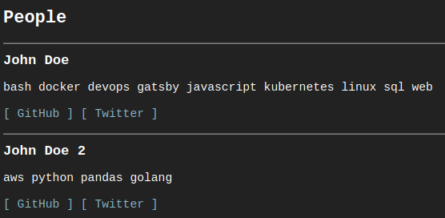

## I just finished giving HenryNeeds.Coffee its annual-ish refresh. I updated the menu bar, split up a lot of the homepage into separate content-specific pages, but my favorite addition is the new [Signal Boost](https://henryneeds.coffee/signal-boost) page.

When I was looking around for refresh inspiration, I came across [Christine Dodrill's website](https://christine.website). It has a similar terminal-ish design as mine but with way better colors for everything - which honestly is what I wanted to address with the refresh.

But in looking through Christine's site, I found the Signal Boost page - designed to put a spotlight on other tech folks looking for work. After a year where a lot of people lost their jobs, I felt it was a better use of my time to set up a signal boost page of my own rather than making some colors look better.

There are so many developers, engineers, ops folks, and all kinds of other tech workers trying to land a new gig right now. I'm lucky enough to still be working, so providing visibility to those who aren't is the least I can do with the small platform I have.

I only got to where I am with the help of my friends and colleagues. This is something small I can do to pay that forward, and I encourage y'all to set up something similar.

In that vein, I wanted to share how I threw this together so that you can, too.

---

First off, this site's code is available in this [GitHub repo](https://github.com/Quinncuatro/Henry-Personal-Website), but I'll go into specifics about how this particular feature works.

[HenryNeeds.Coffee](https://henryneeds.coffee) was built using [GatsbyJS](https://www.gatsbyjs.com/), and it all sits on top of a hello-world base.

In Gatsby sites, data has to come from somewhere, and I already had certain plugins (like [gatsby-source-filesystem](https://www.gatsbyjs.com/plugins/gatsby-source-filesystem/) and [gatsby-transformer-yaml](https://www.gatsbyjs.com/plugins/gatsby-transformer-yaml/)) installed and my `./gatsby-config.js` file configured to ingest yaml so that it can be queried with GraphQL.

I had that part of Gatsby's content mesh set up to turn `./src/resume/resume.yaml` into content for my `Resume` and `Talks // Pods` pages. I expanded that out to power my `Blog` page with markdown files, and expanded it again to handle `Signal Boost`.

First off, though, I needed to make a new page so that `https://henryneeds.coffee/signal-boost` would resolve to something:

```jsx
// Whole of ./src/pages/signal-boost.js
import React from "react"
import Layout from "../components/Layout"
import SignalBoostLogin from "../components/SignalBoostLogin"

export default () => (
  <Layout>
    <SignalBoostLogin />
  </Layout>
);
```

All this file does is import and render a component named `SignalBoostLogin`. That component handles things like important the menu bar, doing some date math for the "Current login" header. But its main job is querying data provided by `./src/signalboost/signalboost.yaml` (more on that later) and then iterating over those results to set up individual `SignalBoost` components.

```jsx
// Selection from ./src/components/SignalBoostLogin/index.js
<StaticQuery
    query={graphql`
      query signalBoostQuery {
        allSignalboostYaml {
          edges {
            node {
              people {
                name
                tech
                github
                twitter
              }
            }
          }
        }
      }
    `}
    render={SignalBoostPage}
  />
```

This is the GraphQL query that pulls information defined in that `/.src/signalboost/signalboost.yaml` file then renders the `SignalBoostPage` component (in the same file) which ingests the GraphQL results as `data`.

```jsx
// Selection from ./src/components/SignalBoostLogin/index.js
{data.allSignalboostYaml.edges[0].node.people.map((person) => (
  <SignalBoost
    name={person.name}
    tech={person.tech}
    github={person.github}
    twitter={person.twitter}
  />
))}
```

Like I said earlier, this page is just meant to grab the data provided by the yaml file, iterate over it, and generate individual `SignalBoost` components for each entry via that `.map()` method. The whole `name={person.name}` bit passes all the individual data points from the GraphQL results as props that can be picked up and used by the child component (`SignalBoost`).

```jsx
// Whole of ./src/components/SignalBoost/index.js
import React from "react"

export default (props) => (
  <div>
    <h3>{ props.name }</h3>
    <p>{ props.tech }</p>
    <p><a href={ props.github } target="_blank" rel="noopener noreferrer">[ GitHub ]</a>&nbsp;<a href={ props.twitter } target="_blank" rel="noopener noreferrer">[ Twitter ]</a></p>
    <hr />
  </div>
)
```

And this (finally) is the template that takes those props, throws the values into the HTML, and renders out individual divs of name/tech/links on the final Signal Boost page.

---

So to recap:

1. The actual data gets updated in the `./src/signalboost/signalboost.yaml` file.
2. The page served by the `https://henryneeds.coffee/signal-boost` URL calls the `./src/components/SignalBoostLogin/` component.
3. That component queries the data provided by the `./src/signalboost/signalboost.yaml` file, iterates over it, and calls multiple `./src/components/SignalBoost/` components.
4. Each of those components takes the data passed to it as props and renders out HTML for each person being signal boosted.

---

So yaml like this:

```yaml
# ./src/signalboost/signalboost.yaml
people:
  - name: "John Doe"
    tech: "bash docker devops gatsby javascript kubernetes linux sql web"
    github: "https://github.com/username"
    twitter: "https://twitter.com/username"
  - name: "John Doe 2"
    tech: "aws python pandas golang"
    github: "https://github.com/username2"
    twitter: "https://twitter.com/username2"
```

Will render this:



---

If anyone wants to add themself, all they need to do is follow the [instructions here](https://github.com/Quinncuatro/Henry-Personal-Website/tree/master/src/signalboost), edit the YAML file, and submit a pull request.

Once I get the notification, check the formatting, and roll the change into my main branch: builds will automatically kick off on Netlify and Fleek to deploy the updated version.

---

It took me a couple of days' worth of free cycles to figure this all out and get it working the way I like it, but the current version works great!

So far I've had two folks submit PR's and it went off without a hitch. They submitted their PR, I hit the "Merge" button, and the builds kicked off all on their own.

Building the feature was pretty painless given that I already had my site built on Gatsby's engine. However, adding something like this to a different static site generator or build process should be fairly easy once you understand the data flow.

Lots of folks lost their jobs over the past year, and really what's the point of having a voice, site, blog, or whatever if we don't help others climb up behind us on the same ladders?

Just something to chew on.

Stay frosty.

- [https://henryneeds.coffee](https://henryneeds.coffee) ([IPFS Version](ipfs://bafybeid36rtd2rpjzhz7ll4foruef3vj3n3pbrev53wcwj6pj6q3u4ie7q/))
- [Blog](https://henryneeds.coffee/blog) ([IPFS Version](https://ipfs.fleek.co/ipfs/bafybeid36rtd2rpjzhz7ll4foruef3vj3n3pbrev53wcwj6pj6q3u4ie7q/blog))
- [LinkedIn](https://linkedin.com/in/henryquinniv)
- [Twitter](https://twitter.com/quinncuatro)
